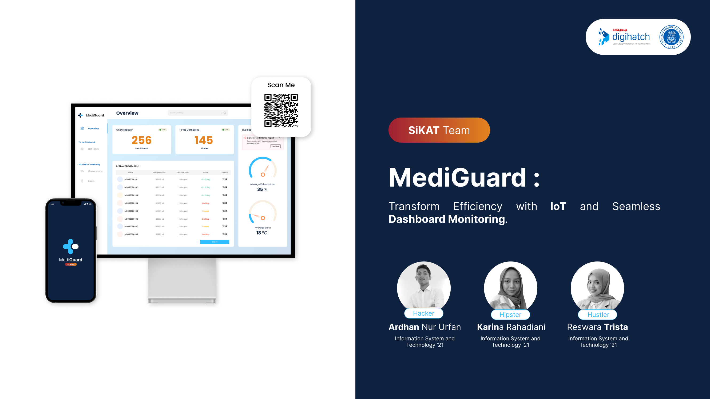

<h1 align="center">
   MediGuard BackEnd
</h1>

<p align="center">
  
</p>

<p align="center">
  
</p>

<hr>

## Links

> You can access this project **Presentation Document** [here](https://drive.google.com/file/d/1CQkhwUdCbhxuCJ99sjeLs7n6yPRZ4OtA/view?usp=sharing).

> You can access this project **Presentation Video** [here](https://drive.google.com/file/d/1WU9sOQmbLlwPh9UiBEErLX7TM-E2cEbQ/view?usp=sharing).

> You can access the **FrontEnd** repository [here](https://github.com/ardhanurfan/MediGuard-web).

> You can access the **Back End** repository [here](https://github.com/ardhanurfan/mediguardserver).

> You can access the **Mobile App** repository [here](https://github.com/ardhanurfan/MediGuard-mobile).

## Table of Contents

1. [General Information](#general-information)
2. [Technologies Used](#technologies-used)
3. [Installation](#installation)
4. [Structure](#structure)
5. [Our Team](#team)
6. [Copyright](#copyright)

<a name="general-information">

## General Information

This is project for Digihatch Dexa Group Hackathon. MediGuard is software for pharmaceutical logistics. This app have some features such as:

- Admin dashboard for monitoring and assign to driver. When assigning, a vendor analysis will be carried out in terms of distance, time and price. Beside that, customer will receive QR Code to unlock the MediGuard Hardware.
- Mobile Apps for driver. Driver assigned by Admin, will use mobile application for product monitoring and unlock MediGuard by scanning the customer's QR Code.
- MediGuard IoT Hardware. Based on Internet of Things Technology for monitoring humidity, temperature, and GPS tracking. This hardware will also maintain security by locking packages.

<a name="technologies-used"></a>

## Technologies Used

This project using some technologies :

- [React](https://react.dev/)
- [Vite](https://vitejs.dev/guide/)
- [Tailwindcss](https://tailwindcss.com/docs/installation)
- NodeJS
- Socket.io
- MongoDB
- Flutter
- MQTT

This project also connected with API services provider :

- Google Maps API
- WhatsApp API
- Raja Ongkir API

<a name="installation">

## Installation

Then, run the development server:

```bash
npm run dev
# or
yarn dev
```

Open [http://localhost:3000](http://localhost:3000) with your browser to see the result.

<a name="structure">

## Structure

```bash
├── .env
├── app.js
├── bin
│  └── www
├── config
│  └── index.js
├── controller
│  ├── BranchController.js
│  ├── DeliveryCatController.js
│  ├── DestinationController.js
│  ├── ProductController.js
│  ├── RelationController.js
│  ├── TransactionController.js
│  ├── UnitController.js
│  ├── UserController.js
│  ├── VendorController.js
│  └── WhatsappController.js
├── dataset
│  ├── branch.json
│  ├── cityRajaOngkir.json
│  ├── deliveryCat.json
│  ├── destination.json
│  ├── product.json
│  ├── relation.json
│  ├── transaction.json
│  ├── unit.json
│  ├── user.json
│  └── vendor.json
├── db
│  └── index.js
├── docker-compose.yaml
├── Dockerfile
├── middleware
│  └── auth.js
├── models
│  ├── BranchModel.js
│  ├── DeliveryCatModel.js
│  ├── DestinationModel.js
│  ├── ProductModel.js
│  ├── RelationModel.js
│  ├── TransactionModel.js
│  ├── UnitModel.js
│  ├── UserModel.js
│  └── VendorModel.js
├── mqtt
│  └── index.js
├── new.tree
├── package-lock.json
├── package.json
├── public
│  ├── images
│  │  └── icon.png
│  ├── javascripts
│  └── stylesheets
│    └── style.css
├── readme.md
├── router
│  ├── BranchRouter.js
│  ├── DeliveryCatRouter.js
│  ├── DestinationRouter.js
│  ├── ProductRouter.js
│  ├── RelationRouter.js
│  ├── TransactionRouter.js
│  ├── UnitRouter.js
│  ├── UserRouter.js
│  ├── VendorRouter.js
│  └── WhatsappRouter.js
├── views
│  ├── error.ejs
│  └── index.ejs
└── wwebjs
  └── index.js
```

<a name="team">

## Our Team

- Ardhan Nur Urfan
- Reswara Trista
- Karina Rahadiani

<a name="copyright"></a>

## Copyright

<h4 align="center">
  Sikat Team. Copyrights @2023
</h4>

</hr>
